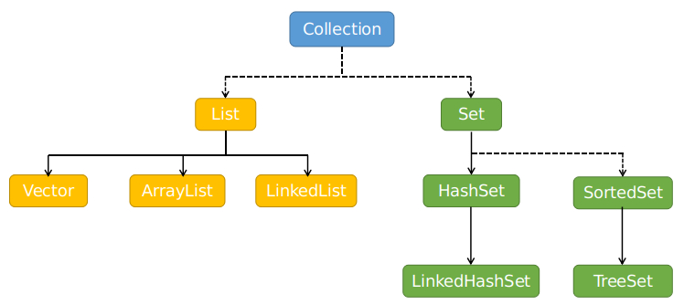
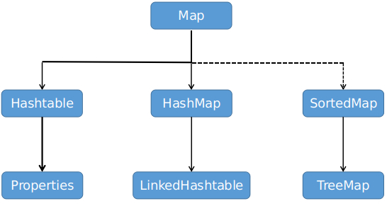

## 集合总结

> copy from zengsiyan


Java对事物的体现都是以对象的形式，为了方便对多个对象的操作，就要对对象进行存储<font color=red>（内存上的存储）</font>。

然而使用数组存储对象存在一些弊端，因此，Java引入集合框架，实现<font color=red>**动态**</font>的存储对象的容器。

* 首先，了解<font color=red>数组</font>的**特点**与**局限性**：

> * 数组在内存存储方面的特点：
>   * 数组初始化以后，**长度就确定了**。
>   * 数组声明的类型就决定了元素初始化的**类型**。
> * 数组在存储数据方面的弊端：
>   * 数组初始化以后长度不可改变，**无法扩展**。
>   * 数组提供的属性和方法相对较少，不便于增、删（或**效率不高**）
>   * 数组存储数据有序可重复（或**存储数据的特点单一**）

而数组的弊端在Java集合上都得到了解决。


* Java集合分为<font color=red>**Collection接口**</font>和<font color=red>**Map接口**</font>两大块：


$$
x \begin{cases}Collection：单列数据，定义了存取一组对象的方法的集合\\\\Map：双列数据，保存具有映射关系“key-value对”的集合\end{cases}
$$


​					
​						






## 1. List接口

### 1.1 ArrayList源码分析

1. **底层的物理存储结构：**

```java
// non-private to simplify nested class access
transient Object[] elementData; 
```

可见，ArrayList的物理存储结构为Object类型的数组——elementData。

然后，一个私有整型变量记录elementData中真实存放的元素的个数：

```java
/**
  * The size of the ArrayList (the number of elements it contains).
  *
  * @serial
  */
private int size;
```

2. **构造器：**

* **空参构造**：

```java
/**
  * Constructs an empty list with an initial capacity of ten.
  * 这个注释是JDK7的注释，如果是JDK7，那么这里会创建出一个默认长度为10的Object[]数组
  * 而JDK8没有直接创建长度为10的数组。
  */
public ArrayList() {
    // 直接将elementData赋值为DEFAULTCAPACITY_EMPTY_ELEMENTDATA
    this.elementData = DEFAULTCAPACITY_EMPTY_ELEMENTDATA;
}
```

```java
/**
  * Shared empty array instance used for default sized empty instances. We
  * distinguish this from EMPTY_ELEMENTDATA to know how much to inflate when
  * first element is added.
  */
// DEFAULTCAPACITY_EMPTY_ELEMENTDATA是全局常量，长度为0的Object数组，JDK8这样做的好处是最大限度的节省了内存空间，它会等到真正添加元素时再创建数组。
private static final Object[] DEFAULTCAPACITY_EMPTY_ELEMENTDATA = {};
```

意即：调用ArrayList的空参构造器，底层会将全局常量（一个长度为0的Object数组）赋给elementData。

* **定容构造：**

```java
/**
  * Constructs an empty list with the specified initial capacity.
  *
  * @param  initialCapacity  the initial capacity of the list
  * @throws IllegalArgumentException if the specified initial capacity
  *         is negative
  */
public ArrayList(int initialCapacity) {
    // 初始容量大于0，那么创建指定容量的Object数组赋值给elementData
    if (initialCapacity > 0) {
        this.elementData = new Object[initialCapacity];
    } else if (initialCapacity == 0) {	// 指定容量为0，将elementData赋值为空数组
        this.elementData = EMPTY_ELEMENTDATA;
    } else {	// 指定容量为负数，抛出异常
        throw new IllegalArgumentException("Illegal Capacity: "+
                                           initialCapacity);
    }
}
```

```java
/**
  * Shared empty array instance used for empty instances.
  */
// 如果定容构造器的容量被指定为0，那么elementData也被赋值为一个全局常量。（长度为0的Object数组）。
private static final Object[] EMPTY_ELEMENTDATA = {};
```

注意：

> <font color=red>**EMPTY_ELEMENTDATA**</font> 与 <font color=red>**DEFAULTCAPACITY_EMPTY_ELEMENTDATA**</font>均是长度为0的Object数组，且均是全局常量。
>
> 但是前者是在定容构造器容量为0时为elementData赋值（理论上的容量是0）。
>
> 后者是空参构造器为elementData赋值（理论上的容量是10，只是现在没有创建）。它实际上是在add时再创建。

3. **add(E e)方法**

```java
/**
  * Appends the specified element to the end of this list.
  *
  * @param e element to be appended to this list
  * @return <tt>true</tt> (as specified by {@link Collection#add})
  */
public boolean add(E e) {
    ensureCapacityInternal(size + 1);  // Increments modCount!!
    elementData[size++] = e;		// 容量满足需求了，那将指定的这个元素追加到原数组末尾
    return true;
}
```

首先是确定增加一个元素后，需不需要扩容。然后在满足容量的elementData中新增元素便可。

```java
// 将必须存储的最小容量值作为参数（minCapacity）传入，以判断是否有扩容的必要
private void ensureCapacityInternal(int minCapacity) {
    ensureExplicitCapacity(calculateCapacity(elementData, minCapacity));
}
```

```java
// 计算一次容量，实际上是顺应空参构造中的DEFAULTCAPACITY_EMPTY_ELEMENTDATA
private static int calculateCapacity(Object[] elementData, int minCapacity) {
    // 这里就体现了JDK8与JDK7不同的地方，对于空参构造，JDK8是在这里为默认长度为10的Object开辟空间的。即如果elementData是被空参构造赋值过且数组未使用过，那么返回默认长度和最小长度中最大的那个值作为新的最小长度。
    if (elementData == DEFAULTCAPACITY_EMPTY_ELEMENTDATA) {
        // DEFAULT_CAPACITY是类中定义的全局常量，它的值为10
        return Math.max(DEFAULT_CAPACITY, minCapacity);
    }
    // 如果elementData不是默认空参构造过未初始化的，那么直接返回最小容量
    return minCapacity;
}
```

```java
private void ensureExplicitCapacity(int minCapacity) {
    modCount++;
	
    // overflow-conscious code
    if (minCapacity - elementData.length > 0)	// 判断是否有扩容的必要
        grow(minCapacity);	// 扩容方法的具体实现
}
```

```java
/**
  * Increases the capacity to ensure that it can hold at least the
  * number of elements specified by the minimum capacity argument.
  *
  * @param minCapacity the desired minimum capacity
  */
private void grow(int minCapacity) {
    // overflow-conscious code
    int oldCapacity = elementData.length;	// 绑定原有长度
    // 将新长度扩容为原有长度的1.5倍（原长+原长/2）
    int newCapacity = oldCapacity + (oldCapacity >> 1);
    // 如果新长度还是小于最小容量，那么最小容量就作为新长度（默认空参构造会在这里被指定为10）
    if (newCapacity - minCapacity < 0)
        newCapacity = minCapacity;
    if (newCapacity - MAX_ARRAY_SIZE > 0)	// 极端的大于整数界限的情况
        newCapacity = hugeCapacity(minCapacity);
    // minCapacity is usually close to size, so this is a win:
    elementData = Arrays.copyOf(elementData, newCapacity);	// 数组扩容方法，将elementData扩容为newCapacity，并且原有数据不变，返回值更新elementData
}
```

至此，ArrayList的一次add就完成了。

**小结：JDK8在处理ArrayList的空参构造上使用<font color=red>延迟创建</font>的方式，较大限度的节省了内存空间。**


### 1.2 LinkedList源码分析

1. **底层的物理存储结构：**

底层的物理存储结构是<font color=red>双向链表</font>，其定义了名为Node的内部类：

```java
private static class Node<E> {
    // 三个属性元素、后序节点、前序节点
    E item;		
    Node<E> next;
    Node<E> prev;
	// 构造器
    Node(Node<E> prev, E element, Node<E> next) {
        this.item = element;
        this.next = next;
        this.prev = prev;
    }
}
```

LinkedList中比较核心的<font color=red>三个属性</font>：

```java
transient int size = 0;		// 记录双向链表中元素的个数
```

```java
/**
  * Pointer to first node.
  * Invariant: (first == null && last == null) ||
  *            (first.prev == null && first.item != null)
  */
transient Node<E> first;	// 标识双向链表中第一个元素所在的节点
```

```java
/**
  * Pointer to last node.
  * Invariant: (first == null && last == null) ||
  *            (last.next == null && last.item != null)
  */
transient Node<E> last;		// 标识双向链表中最后一个元素所在的节点
```

2. **构造器：**

```java
/**
  * Constructs an empty list.
  */
public LinkedList() {
}
```

如上，空参构造器调Object的空参构造，它们什么都不会做，也就是那三个属性都将是默认值：

> * size = 0;	
>
> * first = null;
> * last = null;

3. **add(E e)：**

因为双向链表本身就是动态的，因此不在需要频繁的去考虑扩容、缩容等问题了。其add方法就是新建一个节点，然后将这个节点的指针与链表末尾节点的指针绑定好就可以了。

```java
/**
  * Appends the specified element to the end of this list.
  *
  * <p>This method is equivalent to {@link #addLast}.
  *
  * @param e element to be appended to this list
  * @return {@code true} (as specified by {@link Collection#add})
  */
public boolean add(E e) {
    linkLast(e);	// 在双向链表的尾部添加元素
    return true;
}
```

```java
/**
  * Links e as last element.
  */
void linkLast(E e) {
    final Node<E> l = last;		// 绑定双向链表的尾节点
    // 创建待添加的新节点，前序节点为双向链表的尾节点，后序节点为空
    final Node<E> newNode = new Node<>(l, e, null);	
    // 更新双向链表的尾节点
    last = newNode;
    // 如果原双向链表为空（原尾节点为null代表链表空）
    if (l == null)
        first = newNode;	// 那么首节点和尾节点都会指向这个新增的第一个节点
    else					// 如果原双向链表非空，那么原尾节点的后续指向新增节点
        l.next = newNode;
    size++;					// 双向链表元素个数加一
    modCount++;
}
```


### 1.3 Collections.SynchronizedList和Vector的区别

- 如果使用add方法，那么他们的扩容机制不一样。

- SynchronizedList可以指定锁定的对象。

（Collections.SynchronizedList只是使用同步代码块包裹了ArrayList的方法，而ArrayList和Vector中同名方法的方法体内容并无太大差异，所以在锁定范围和锁的作用域上两者并无却别。 在锁定的对象区别上，SynchronizedList的同步代码块锁定的是mutex对象，Vector锁定的是this对象。那么mutex对象是SynchronizedList在使用构造函数时可以传入一个Object,如果在调用的时候显示的传入一个对象，那么锁定的就是用户传入的对象。如果没有指定，那么锁定的也是this对象。）


## 2. Set接口

* Set接口继承了Collection接口，而且Set接口内没有额外的提供方法。

* Set接口代表了**无序、不可重复**的集合。
* Set的主要实现类有：<font color=red>HashSet、LinkedHashSet、TreeSet</font>。

> * HashSet：
>   * Set接口的主要实现类。
>   * 线程不安全，效率高。
>   * 能够存储null值。
> * LinkedHashSet：
>   * 是HashSet的子类。
>   * 以链表的方式组织，可以<font color=red>按照添加时的顺序</font>遍历LinkedHashSet中的数据。
> * TreeSet：
>   * 底层使用HashMap，即，实际采用<font color=red>**红黑树**</font>存储。
>   * 要求TreeSet中存放的对象均属于同一个类。
>   * 可以按照对象指定的属性进行排序。

* **理解Set的无序性：**

> Set的无序性不等同于随机性，它存储的数据在底层不是依次存放的，<font color=red>而是根据数据的Hash值决定元素的存放位置。</font>

* **理解Set的不可重复性：**

> Set中保证添加的元素在使用equals()方法判断时不能返回true，即相同的元不能被添加进来。
>
> <font color=red>**注意**：Set判断重复元素的方法是先根据hashCode方法返回的hash值确定元素要存放的位置索引，然后再与具有相同索引的所有元素去equals()。</font>这样做可以大大减少比较次数，提高效率。


**<font color=red>由此也可知，Set中存放的元素类型应该是重写了equals()和hashCode()的类型。意即，使用HashSet及其子类，必定需要重写equals()和hashCode()方法，而且equals()和hashCode()方法的重写应当要满足相等的对象应该具有相等的hash值的原则。</font>**


### 2.1 重写hashCode()

使用IDEA自动重写hashCode()方法时，会发现有系数<font color=red>31</font>，原因：

* 选择系数的时候要选择尽量大的系数，因为如果计算出来的hash地址越大，所谓的“冲突”就会越少，查找起来的效率就会越高。<font color=red>(所以一般要乘以一个系数)</font>
* 并且31只占用5bits，**相乘造成数据溢出的概率较小**。
* i*31可以由<font color=red>( i << 5 ) - 1</font>来表示，现在很多虚拟机都有相关的优化，能够提高算法效率。
* 31是一个素数，素数的作用就是某个数乘以一个素数，那么结果只能被被乘数、素数本身和1整除，同样可以减少冲突。

比如：

```java
class Person{
    String name;
    int age;

    @Override
    public boolean equals(Object o) {
        if (this == o) {
            return true;
        }
        if (!(o instanceof Person)) {
            return false;
        }
        Person person = (Person) o;
        return age == person.age &&
                Objects.equals(name, person.name);
    }
	// 重写Object类的hashCode方法
    @Override
    public int hashCode() {
        return Objects.hash(name, age);
    }
}
```

Object.hash(name, age)实际上调用的是：

```java
public static int hash(Object... values) {	// 可变长参数
    return Arrays.hashCode(values);
}

public static int hashCode(Object a[]) {
    if (a == null)
        return 0;
    int result = 1;
    // 这里可见其生成hash值的过程
    for (Object element : a)
        // 如果elemenet是null，那么返回0，如果不是那么返回这个类型重写的hashCode值然后与乘了31的result进行累和
        result = 31 * result + (element == null ? 0 : element.hashCode());
    return result;
}
```

* 重写hashCode与equals应该要具有一致性，即<font color=red>**equals()中比较的属性在hashCode中也要用到。**</font>


### 2.2  主要实现类

1. **HashSet**

- HashSet底层是以<font color=red>”数组+链表“</font>的方式实现的。
- HashSet中元素添加的过程：**【必须理解这个过程，这也是HashMap的过程】**

> - 想要在HashSet中添加元素a，那么**首先要调用元素a所在类的hashCode方法**，计算元素a的hash值。
> - 此hash值通过某种hash函数确定（计算出）**HashSet底层数组中的存放位置**。判断该位置是否有其他元素。
>   - 如果没有其他元素，那么直接添加，返回<font color=red>**添加成功**</font>。
>   - 如果有其他元素<font color=red>**（并且这些元素会以链表形式存放）**</font>，那么针对链表上的每个元素调用a元素所在类的equals方法<font color=red>比较两个元素内容是否相等</font>
>     - 如果equals返回true，那么<font color=red>**添加失败**</font>。
>     - a.equals(链上所有元素)均返回false，那么元素a**<font color=red>添加成功</font>**。


2. **LinkedHashSet**

LinkedHashSet作为HashSet的子类，在添加数据<font color=red>（添加数据的操作与HashSet一样）</font>的同时每个数据还维护了<font color=red>两个引用</font>，记录此数据的前序数据和后序数据。

优点： 在需要对集合进行频繁的遍历时，LinkedHashSet效率高于HashSet。


3. **TreeSet**

* TreeSet的底层实现是红黑树。
* 向TreeSet中添加的元素必须是同一个类的对象。（因为TreeSet是实现排序类的，如果要排序，那么集合中存储的元素应该都具有相同的属性）。

* 使用TreeSet的空参构造 —— 自然排序。

```java
class Person implements Comparable {
    String name;
    int age;

    public Person(String name, int age) {
        this.name = name;
        this.age = age;
    }

    @Override
    public String toString() {
        return "Person{" +
                "name='" + name + '\'' +
                ", age=" + age +
                '}';
    }

    @Override
    public int compareTo(Object o) {
        if (o instanceof Person) {
            Person that = (Person) o;
            return this.name.compareTo(that.name);
        }
        throw new IllegalArgumentException("illegal argument!");
    }
}
```

```java
public static void main(String[] args) {
    // 空参构造，以自然排序为依据
    Set set = new TreeSet();
    set.add(new Person("tina", 15));
    set.add(new Person("tony", 19));
    set.add(new Person("kobe", 23));
    set.add(new Person("jhon", 17));
    set.add(new Person("jhon", 13));
    for (Object o : set) {
        System.out.println(o);
    }
}
```

运行结果：

```java
Person{name='jhon', age=17}
Person{name='kobe', age=23}
Person{name='tina', age=15}
Person{name='tony', age=19}
```

分析：

> 输出的结果中，最后一条记录new Person("jhon", 13)没有加入集合。原因：
>
> * **<font color=red>特别注意</font>**，如果TreeSet中的元素使用的是自然排序（实现Comparable接口），<font color=red>那么TreeSet认为比较两个元素是否相等的标准为Comparable接口中compareTo方法的返回值（返回值为0则相等，不为0则不等）</font>。不再是equals方法了。然而，TreeSet中是不允许存放相等的元素的（这是Set集合的共性），所以最后这条名为jhon的记录就没有被添加到集合中。


* 使用TreeSet的比较器构造 —— 定制排序

```java
// 不让Person类实现Comparable接口，而是在实例化TreeSet对象的时候使用Comparator构造器，便可实现定制排序。
public static void main(String[] args) {
    // 将Comparator实现类的对象作为参数来实现定制排序
    Set set = new TreeSet(new Comparator() {
        @Override
        public int compare(Object o1, Object o2) {
            if (o1 instanceof Person && o2 instanceof Person) {
                Person person1 = (Person) o1;
                Person person2 = (Person) o2;
                return Integer.compare(person1.age, person2.age);
            }
            throw new IllegalArgumentException("illegal argument!");
        }
    });

    set.add(new Person("tina", 15));
    set.add(new Person("tony", 19));
    set.add(new Person("kobe", 23));
    set.add(new Person("jhon", 17));
    set.add(new Person("jhon", 13));

    for (Object o : set) {
        System.out.println(o);
    }
}
```

* 同样，使用定制排序来实例化TreeSet对象，它内部比较两个元素是否相等的依据也是比较器中compare方法，而不是equals。
* 其实**<font color=red>排序的属性不能重复</font>**的原理很简单，**因为TreeSet底层是红黑树实现的（二叉树），父节点的左子节点必定小于父节点，右子节点必定大于父节点。不会存在两个节点相同的情况！**


### 2.3 面试题

假设Person类重写了equals()与hashCode()方法，考虑如下程序的运行结果：

```java
public static void main(String[] args) {
    HashSet set = new HashSet();
    Person p1 = new Person(1001, "AA");
    Person p2 = new Person(1002, "BB");
    set.add(p1);
    set.add(p2);
    System.out.println(set);
    p1.name = "CC";
    set.remove(p1);
    System.out.println(set);
    set.add(new Person(1001, "CC"));
    System.out.println(set);
    set.add(new Person(1001, "AA"));
    System.out.println(set);
}
```

运行结果:

```java
[Person{name='BB', age=1002}, Person{name='AA', age=1001}]
[Person{name='BB', age=1002}, Person{name='CC', age=1001}]
[Person{name='BB', age=1002}, Person{name='CC', age=1001}, Person{name='CC', age=1001}]
[Person{name='BB', age=1002}, Person{name='CC', age=1001}, Person{name='CC', age=1001}, Person{name='AA', age=1001}]
```

分析：

> * 第一行输出没有疑问，显然p1和p2的哈希值是不同的，直接输出集合中的两个元素p1和p2。
> * 程序在执行p1.name = "CC";后再去调用remove方法，那么系统就会根据p1对象生成的新的哈希值去找底层存储p1对象的位置。
>   * 然而，<font color=red>之前存放位置的哈希值是根据AA生成的，现在是以CC生成的哈希值去寻找，自然位置不同，那么HashSet会认为集合中根本就没有这个p1这个对象，</font>因此直接没有进行删除操作。所以得到第二行的输出。
> * 程序在执行set.add(new Person(1001, "CC"));后，会根据1001和CC两个属性去生成哈希值，然后去存放这个新的Person对象。
>   * 然而之前的程序并<font color=red>没有在这个哈希值的位置存放任何内容</font>，因此这个对象将被成功放入集合中。所以得到第三行输出。
> * 程序在执行set.add(new Person(1001, "AA"));后，会根据1001和AA两个属性生成哈希值，然后去存放这个新的Person对象。
>   * 然而这个位置已经存放了对象Person(1001, "CC")，<font color=red>因此系统会转而去判断equals()的返回值</font>。很显然，返回值为false，因此Person(1001, "AA")对象被成功添加到集合中。所以得到第四行输出。


## 3. Map接口

Map接口作为双列数据的主接口，主要用于存放键值对数据。

Map接口的主要实现类：

> * HashMap：作为Map接口的<font color=red>主要实现类</font>。线程不安全，效率高。能够存储null的key和value。<font color=red>底层实现，JDK7为数组+链表，JDK8为数组+链表+红黑树。</font>
>   * LinkedHashMap：HashMap的子类。保证在遍历Map元素时，可以按照添加的顺序实现遍历**（原因，在HashMap的底层结构基础上，添加了一对指针，指向前一个和后一个元素）**。<font color=red>对于频繁的遍历操作，此类的执行效率高于HashMap。</font>
> * TreeMap：保证按照添加的key-value对进行排序，实现排序遍历。排序依据为key（比较key是唯一的、不重复的）。<font color=red>底层使用红黑树实现。</font>
> * Hashtable：作为Map接口的古老实现类。线程安全，效率相对较低。不能够存储null的key和value。<font color=red>（基本不会使用，即使需要线程安全的也会找Collections的方法替代）</font>
>   * Properties：Hashtable的子类，其key和value都是String类型的。常用来处理配置文件。 


* **理解Map结构**

$$
\begin{cases}
1. key\\
\\
2. value\\
\\
3. Entry
\end{cases}
$$

> * **<font color=red>key 是无序的不可重复的，其主要使用Set来存储所有的key</font>**。但是具体是什么类型的Set就要看是什么类型的Map了。（比如，如果是HashMap，那么key就用HashSet，如果是LinkedHasMap，那么key就用LinkedHashSet）。
> * **<font color=red>value是无序可重复的</font>**，泛泛来说就是用Collection存储的。
> * **<font color=red>Entry是无序不可重复的，</font>**使用Set进行存储。注意，一个key-value(键值对)就构成一个Entry对象。


### 3.1 HashMap源码分析

* JDK7的与JDK8的HashMap实现略有不同，主要以JDK8为准，然后选择性提示JDK7中的区别部分。

* JDK8中HashMap的底层实现主要是：<font color=red>数组 + 链表 + 红黑树</font>。

HashMap中一些主要常量与结构：

* 常量：

```java
/**
  * The default initial capacity - MUST be a power of two.
  * 全局常量，默认初始化数组容量，定义为16.
  */
static final int DEFAULT_INITIAL_CAPACITY = 1 << 4; // aka 16
```

```java
/**
  * The maximum capacity, used if a higher value is implicitly specified
  * by either of the constructors with arguments.
  * MUST be a power of two <= 1<<30.
  * 全局常量，数组能够承受的最大容量，定义为2^30。
  */
static final int MAXIMUM_CAPACITY = 1 << 30;
```

```java
/**
  * The load factor used when none specified in constructor.
  * 全局常量，默认加载因子0.75，其作用是用于判断数组是否需要扩容
  */
static final float DEFAULT_LOAD_FACTOR = 0.75f;
```

```java
/**
  * The bin count threshold for using a tree rather than list for a
  * bin.  Bins are converted to trees when adding an element to a
  * bin with at least this many nodes. The value must be greater
  * than 2 and should be at least 8 to mesh with assumptions in
  * tree removal about conversion back to plain bins upon
  * shrinkage.
  * 全局常量，如果某个数组位置的链表长度大于这个默认阈值8，那么就将链表转化成红黑树
  */
static final int TREEIFY_THRESHOLD = 8;
```

```java
/**
  * The bin count threshold for untreeifying a (split) bin during a
  * resize operation. Should be less than TREEIFY_THRESHOLD, and at
  * most 6 to mesh with shrinkage detection under removal.
  * 全局常量，如果某个数组位置的红黑树节点个数小于这个阈值，那么就将红黑树转换成链表
  */
static final int UNTREEIFY_THRESHOLD = 6;
```

* 结构

```java
/**
  * Basic hash bin node, used for most entries.  (See below for
  * TreeNode subclass, and in LinkedHashMap for its Entry subclass.)
  * 静态内部类，存放键值对的基本结构Node（JDK7直接是Entry类），Node同样也是实现了Map.Entry接口。
  * 主要的属性是一个标识Node的hash值，一个键，一个值，一个指向下一节点的引用。
  */
static class Node<K,V> implements Map.Entry<K,V> {
    final int hash;
    final K key;	// 注意，键赋值后不能改变，值可以改变
    V value;
    Node<K,V> next;
	// 构造方法
    Node(int hash, K key, V value, Node<K,V> next) {
        this.hash = hash;
        this.key = key;
        this.value = value;
        this.next = next;
    }
	// get方法
    public final K getKey()        { return key; }
    public final V getValue()      { return value; }
    // 重写toString方法
    public final String toString() { return key + "=" + value; }
	// 重写hashCode
    public final int hashCode() {
        return Objects.hashCode(key) ^ Objects.hashCode(value);
    }
	// set方法（只有value能够set，key不能set）
    public final V setValue(V newValue) {
        V oldValue = value;
        value = newValue;
        return oldValue;
    }
	// 重写equals()方法
    public final boolean equals(Object o) {
        if (o == this)
            return true;
        if (o instanceof Map.Entry) {
            Map.Entry<?,?> e = (Map.Entry<?,?>)o;
            if (Objects.equals(key, e.getKey()) &&
                Objects.equals(value, e.getValue()))
                return true;
        }
        return false;
    }
}
```

```java
/**
  * The table, initialized on first use, and resized as
  * necessary. When allocated, length is always a power of two.
  * (We also tolerate length zero in some operations to allow
  * bootstrapping mechanics that are currently not needed.)
  * 核心数组。Node<K,V>类型的数组
  */
transient Node<K,V>[] table;
```

```java
/**
  * Holds cached entrySet(). Note that AbstractMap fields are used
  * for keySet() and values().
  * 键的存放是以Set的方式（不可重复是关键）
  */
transient Set<Map.Entry<K,V>> entrySet;
```

```java
/**
  * The number of key-value mappings contained in this map.
  * 真实元素的长度
  */
transient int size;
```

```java
/**
  * The next size value at which to resize (capacity * load factor).
  * 判断数组是否需要扩容的阈值
  * @serial
  */
// (The javadoc description is true upon serialization.
// Additionally, if the table array has not been allocated, this
// field holds the initial array capacity, or zero signifying
// DEFAULT_INITIAL_CAPACITY.)
int threshold;
```

```java
/**
  * The load factor for the hash table.
  * 加载因子，主要用于判断数组是否需要扩容
  * @serial
  */
final float loadFactor;
```


1. **<font color=red>空参构造</font>**

```java
/**
  * Constructs an empty <tt>HashMap</tt> with the default initial capacity
  * (16) and the default load factor (0.75).
  * 这些注释是JDK7的，如果是JDK7，那么空参构造就会创建一个Entry数组，且默认初始长度为16
  */
public HashMap() {
    // 空参构造中只是简单的指示下加载因子为DEFAULT_LOAD_FACTOR（0.75）; 
    this.loadFactor = DEFAULT_LOAD_FACTOR; // all other fields defaulted
}
```

2. <font color=red>**定容构造**</font>

```java
/**
  * Constructs an empty <tt>HashMap</tt> with the specified initial 
  * capacity and the default load factor (0.75).
  *
  * @param  initialCapacity the initial capacity.
  * @throws IllegalArgumentException if the initial capacity is negative.   
  */
public HashMap(int initialCapacity) {
    // 给定默认的加载因子后，转而调用带加载因子的构造器
    this(initialCapacity, DEFAULT_LOAD_FACTOR);
}
```

```java
/**
  * Constructs an empty <tt>HashMap</tt> with the specified initial
  * capacity and load factor.
  *
  * @param  initialCapacity the initial capacity
  * @param  loadFactor      the load factor
  * @throws IllegalArgumentException if the initial capacity is negative
  *         or the load factor is nonpositive
  */
public HashMap(int initialCapacity, float loadFactor) {
    // 给定初始容量小于0，抛非法参数异常
    if (initialCapacity < 0)
        throw new IllegalArgumentException("Illegal initial capacity: " +
                                           initialCapacity);
    // 给定初始容量大于数组最大，那么数组最大就作为初始常量
    if (initialCapacity > MAXIMUM_CAPACITY)
        initialCapacity = MAXIMUM_CAPACITY;
    // 如果加载因子小于0或加载因子不是合法的浮点数，抛非法参数异常
    if (loadFactor <= 0 || Float.isNaN(loadFactor))
        throw new IllegalArgumentException("Illegal load factor: " +
                                           loadFactor);
    // 为加载因子赋值，并计算阈值（数组是否需要扩容的阈值）
    this.loadFactor = loadFactor;
    this.threshold = tableSizeFor(initialCapacity);
}
```

**注意：**

> * loadFactor与threshold的值直接决定数组是否需要扩容。
>
> * HashMap的扩容不是简单的数组用完了就扩，因为由于Hash冲突等原因，可能在某个数组的索引位置，一个链会拉的很长很长。而其余的数组索引根本就没有使用。所以要引入加载因子。
> * <font color=red>加载因子太大可能导致一个位置上链很长，加载因子太小可能导致数组的利用率太低。</font>可能根据统计学的等计算加载因子为0.75时较合适。


3. <font color=red>**put方法**</font>

可以发现，不论是空参构造，还是两个定容构造，HashMap构造器中并没有创建核心的底层数组。这是JDK8区别与JDK7的地方（JDK7是直接在构造器中就创建了）。与之前的ArrayList类似，JDK8使用了<font color=red>延迟创建机制</font>，**它会在真正需要使用数组的时候再去创建数组，目的是最大限度的减少了内存空间**。

HashMap的put方法主要考虑三个方面的问题：<font color=red>底层数组的创建、数组扩容、红黑树转换</font>。

```java
/**
  * Associates the specified value with the specified key in this map.
  * If the map previously contained a mapping for the key, the old
  * value is replaced.
  *
  * @param key key with which the specified value is to be associated
  * @param value value to be associated with the specified key
  * @return the previous value associated with <tt>key</tt>, or
  *         <tt>null</tt> if there was no mapping for <tt>key</tt>.
  *         (A <tt>null</tt> return can also indicate that the map
  *         previously associated <tt>null</tt> with <tt>key</tt>.)
  * put方法的最外层调用，注意，他是有返回值的，如果当前添加的键值对的键在map中已经存在，那么将旧值替换为新值，并且返回旧值。如果不存在，那么返回null。
  */
public V put(K key, V value) {
    /** 转而调用putVal方法完成处理，参数是：
      * 根据key计算得到的hash值
      * key
      * value
      * 后面两个忽略。。
      **/
    return putVal(hash(key), key, value, false, true);
}
```

```java
/**
  * Implements Map.put and related methods.
  * 该方法是实现put方法的主体，主要流程如下：
  * 	1. 看是否是没有初始化的数组。如果是，那么就转到扩容方法进行初始化。
  * 	2. 计算hash值对应的数组索引位置，如果该位置上没有元素，直接插入成功。
  * 	3. 如果有元素了，那么用当前key的hash值和该索引位置上链表的所有节点的hash值进行比较。如果全都不同，那么插入成功。如果其中有相同的，那么比较调用当前节点的equals()方法进行比较，如果equals()返回false，那么仍然可以插入，如果equals（）返回true那么用当前节点的value去更新旧值。
  * @param hash hash for key
  * @param key the key
  * @param value the value to put
  * @param onlyIfAbsent if true, don't change existing value
  * @param evict if false, the table is in creation mode.
  * @return previous value, or null if none
  */
final V putVal(int hash, K key, V value, boolean onlyIfAbsent,
               boolean evict) {
    // 创建一个tab作为属性table的副本，节点p用来作为某个节点的副本
    Node<K,V>[] tab; Node<K,V> p; int n, i;
    // 如果属性table为空，或者map的长度为0，那么就表示底层数组没有初始化，转而就去调扩容方法来将数组进行初始化。
    if ((tab = table) == null || (n = tab.length) == 0)
        n = (tab = resize()).length;
    // 节点p指向key的hash值计算得到的数组索引位置上的节点，如果这个索引位置上没有元素
    if ((p = tab[i = (n - 1) & hash]) == null)
        // 那么直接调用插入方法，将新节点插入在这个索引位置上
        tab[i] = newNode(hash, key, value, null);
    else {
        // 如果计算得到的数组索引上有元素了
        Node<K,V> e; K k;
        // 如果链表上的头结点和待插入节点的hash值相等且equals也是true，那么后面是直接会执行更新value操作的，这里给e赋值是标志。
        if (p.hash == hash &&
            ((k = p.key) == key || (key != null && key.equals(k))))
            e = p;
        // 如果这个数组索引上不是链表而是红黑树，那么调用红黑树的put操作
        else if (p instanceof TreeNode)
            e = ((TreeNode<K,V>)p).putTreeVal(this, tab, hash, key, value);
        else {
            // 如果待插入节点和头结点没有同一个key，那么比较链表上之后的所有节点的hash值和equals方法。
            for (int binCount = 0; ; ++binCount) {
                // 如果全部比较完，还是没有相同的key那么这里e会是null（就是需要直接插入的情况）
                if ((e = p.next) == null) {
                    // 将新节点插在链表最末尾（七上八下，JDK7是插在头节点前面，JDK8是插在最末尾）
                    p.next = newNode(hash, key, value, null);
                    // 判断一下新节点插入后，链表是否需要转化称红黑树
                    if (binCount >= TREEIFY_THRESHOLD - 1) // -1 for 1st
                        treeifyBin(tab, hash);
                    break;
                }
                // 如果存在与待插入节点相等的key
                if (e.hash == hash &&
                    ((k = e.key) == key || (key != null && key.equals(k))))
                    break;
                // 循环增量
                p = e;
            }
        }
        // e有值，那就是存在与待插入的节点相同的key，那么执行更新旧value的操作
        if (e != null) { // existing mapping for key
            V oldValue = e.value;
            if (!onlyIfAbsent || oldValue == null)
                e.value = value;
            afterNodeAccess(e);
            return oldValue;
        }
    }
    ++modCount;
    // 如果执行了直接插入的操作，那么这里判断一下要不要扩容。且插入节点（没有更新旧value）返回null
    if (++size > threshold)
        resize();
    afterNodeInsertion(evict);
    return null;
}
```

* **有一点需要注意**，<font color=red>即使是同一个数组索引位置上同一链表上的节点，也是会hash值不同的，而且很常见。</font>因为这个索引位置的确定是通过hash值取与运算得到的，所以任然有将待插入元素的key与链表上的所有元素的key比较hash值的必要。

```java
/**
  * Initializes or doubles table size.  If null, allocates in
  * accord with initial capacity target held in field threshold.
  * Otherwise, because we are using power-of-two expansion, the
  * elements from each bin must either stay at same index, or move
  * with a power of two offset in the new table.
  * 数组扩容的主体方法
  * @return the table
  */
final Node<K,V>[] resize() {
    // oldTab作为属性table的副本
    Node<K,V>[] oldTab = table;
    // 如果是空参构造来的这里（数组没有赋值），那么原容量为0，否则就是取原数组的容量
    int oldCap = (oldTab == null) ? 0 : oldTab.length;
    // 属性阈值的副本oldThr
    int oldThr = threshold;
    int newCap, newThr = 0;
    // 如果不是还未使用过的数组
    if (oldCap > 0) {
        // 如果原容量已经（或者大于）最大容量了
        if (oldCap >= MAXIMUM_CAPACITY) {
            // 那么容量不变，阈值更新为整型的最大值
            threshold = Integer.MAX_VALUE;
            return oldTab;
        }
        // 否则，新容量扩容为原来的两倍。
        else if ((newCap = oldCap << 1) < MAXIMUM_CAPACITY &&
                 oldCap >= DEFAULT_INITIAL_CAPACITY)
            // 如果扩容后小于最大容量，并且原容量是大于默认容量的，那么将阈值扩大一倍（原来的两倍）
            newThr = oldThr << 1; // double threshold
    }
    // 定容构造器初始化了阈值，但是如果数组未定义过，因此数组新容量取阈值
    else if (oldThr > 0) // initial capacity was placed in threshold
        newCap = oldThr;
    // 空参构造来到这里（数组没定义过，阈值没初始化过）
    else {               // zero initial threshold signifies using defaults
        newCap = DEFAULT_INITIAL_CAPACITY;	// 新容量为默认容量值：16
        newThr = (int)(DEFAULT_LOAD_FACTOR * DEFAULT_INITIAL_CAPACITY);
    }
    // 如果新阈值为0，（定容构造调用会来到这里）那么，重新计算阈值
    if (newThr == 0) {	
        float ft = (float)newCap * loadFactor;
        newThr = (newCap < MAXIMUM_CAPACITY && ft < (float)MAXIMUM_CAPACITY ?
                  (int)ft : Integer.MAX_VALUE);
    }
    // 将属性阈值更新
    threshold = newThr;
    // 容量确定后，用新容量创建新的底层数组，然后完成将原有数组中的元素嫁接到新数组中的一系列工作
    @SuppressWarnings({"rawtypes","unchecked"})
    Node<K,V>[] newTab = (Node<K,V>[])new Node[newCap];
    table = newTab;		// 数组统一是在这里造的
    if (oldTab != null) {
        for (int j = 0; j < oldCap; ++j) {
            Node<K,V> e;
            if ((e = oldTab[j]) != null) {
                oldTab[j] = null;
                if (e.next == null)
                    newTab[e.hash & (newCap - 1)] = e;
                else if (e instanceof TreeNode)
                    ((TreeNode<K,V>)e).split(this, newTab, j, oldCap);
                else { // preserve order
                    Node<K,V> loHead = null, loTail = null;
                    Node<K,V> hiHead = null, hiTail = null;
                    Node<K,V> next;
                    do {
                        next = e.next;
                        if ((e.hash & oldCap) == 0) {
                            if (loTail == null)
                                loHead = e;
                            else
                                loTail.next = e;
                            loTail = e;
                        }
                        else {
                            if (hiTail == null)
                                hiHead = e;
                            else
                                hiTail.next = e;
                            hiTail = e;
                        }
                    } while ((e = next) != null);
                    if (loTail != null) {
                        loTail.next = null;
                        newTab[j] = loHead;
                    }
                    if (hiTail != null) {
                        hiTail.next = null;
                        newTab[j + oldCap] = hiHead;
                    }
                }
            }
        }
    }
    return newTab;
}
```


### 3.2 LinkedHashMap源码分析

搞懂HashMap的底层实现后LinkedHashMap的底层实现就很简单了。

<font color=red>LinkedHashMap是HashMap的子类，而且LinkedHashMap中很方法并没有重写，而是直接用了父类的方法。</font>因此只需重点关注不同部分。

* 空参构造

```java
/**
  * Constructs an empty insertion-ordered <tt>LinkedHashMap</tt> instance
  * with the default initial capacity (16) and load factor (0.75).
  */
public LinkedHashMap() {
    super();	// 直接调的父类HashMap的空参构造方法
    accessOrder = false;
}
```

* 定容构造

```java
/**
  * Constructs an empty insertion-ordered <tt>LinkedHashMap</tt> instance
  * with the specified initial capacity and a default load factor (0.75).
  *
  * @param  initialCapacity the initial capacity
  * @throws IllegalArgumentException if the initial capacity is negative
  */
public LinkedHashMap(int initialCapacity) {
    super(initialCapacity);	// 同样是父类HashMap定容构造方法
    accessOrder = false;
}
```

因此，重点关注他的put方法如何实现在遍历Map元素时，可以按照添加的顺序实现遍历便可了。

但是

> * LinkedHashMap没有重写父类的put方法，因此子类对象调用put方法是直接去调的父类的put方法。
> * LinkedHashMap也没有重写父类的putValue方法，因此也是直接用的父类方法。

但是，LinkedHashMap重写了父类的newNode方法，即，在向数组（或数组索引位置上的链表）添加元素时，会调用子类自己的newNode方法：

```java
Node<K,V> newNode(int hash, K key, V value, Node<K,V> e) {
    // 调的是LinkedHashMap中自定义的结构Entry
    LinkedHashMap.Entry<K,V> p =
        new LinkedHashMap.Entry<K,V>(hash, key, value, e);
    linkNodeLast(p);
    return p;
}
```

```java
/**
  * HashMap.Node subclass for normal LinkedHashMap entries.
  * Entry是HashMap中Node结构的子类，它继承了父类Node的结构外还定义了两个指针before和after，这样就在底层数组存放的同时，一个指向他的前序一个指向它的后序。
  */
static class Entry<K,V> extends HashMap.Node<K,V> {
    Entry<K,V> before, after;
    Entry(int hash, K key, V value, Node<K,V> next) {
        super(hash, key, value, next);
    }
}
```

* 意即，虽然LinkedHashMap底层的存储仍然是数组+链表+红黑树，<font color=red>但是每个元素节点都配有指向前序和后序的节点。</font>这样，在遍历起来就靠前序、后序找了。针对需要频繁遍历的map而言，提高的效率（遍历效率）。**其余的与HashMap无异。**


### 3.3 TreeMap

向TreeMap中添加键值对，<font color=red>要求key必须是由同一个类创建的对象</font>。因为要按照<key进行排序，因此便要考虑比较器**（Comparable或Comparator）**。

注意，只能按照key中的属性来排序，不能按照value排序。

```java
class Student {
    String name;
    int age;
    public Student(String name, int age) {
        this.name = name;
        this.age = age;
    }
    @Override
    public String toString() {
        return "Student{" +
            "name='" + name + '\'' +
            ", age=" + age +
            '}';
    }
}

public class Test {
    public static void main(String[] args) {
        // 匿名内部类
        Map treeMap = new TreeMap(new Comparator() {
            @Override
            public int compare(Object o1, Object o2) {
                if (o1 instanceof Student && o2 instanceof Student) {
                    Student s1 = (Student) o1;
                    Student s2 = (Student) o2;
                    return Integer.compare(s1.age, s2.age);
                }
                throw new IllegalArgumentException("illegal argument exception!");
            }
        });
		// 按照键的age属性进行排序。切记，不可按值排序
        treeMap.put(new Student("tom", 10), 1);
        treeMap.put(new Student("mary", 9), 2);
        treeMap.put(new Student("kobe", 12), 3);
        treeMap.put(new Student("jerff", 20), 4);
        System.out.println(treeMap);
// 运行结果： {Student{name='mary', age=9}=2, Student{name='tom', age=10}=1, Student{name='kobe', age=12}=3, Student{name='jerff', age=20}=4}
    }
}
```

**<font color=red>注意</font>区别LinkedHashMap的顺序和有TreeMap的有序。前者是能够保证输出的时候能够按照输入的顺序输出，后者是真正的排序。**


### 3.4 Properties

* Properties类是Hashtable类的子类，虽然说Hashtable不怎么用了，但是Properties用于处理属性（配置）文件帮助很大。

* Properties的<font color=red>键值对都是String类型</font>。
* 存取数据建议使用<font color=red>setProperties(String key, String value)方法</font>和<font color=red>getProperties(String key)方法</font>。

考虑如下实例：

```java
import java.io.FileInputStream;
import java.util.Properties;

public class PropertiesTest {

    public static void main(String[] args) throws Exception {
        Properties properties = new Properties();
        // 操作文件需要读取文件流（配置文件为.properties结尾的文件）
        FileInputStream fis = new FileInputStream("config.properties");
        // 加载流对应的文件
        properties.load(fis);
        // 获取配置信息
        String name = properties.getProperty("name");
        String age = properties.getProperty("age");
        System.out.println("name :" + name + "," + "age:" + age);
    }
}
```


## 4. Collections工具类

* Collections是一个操作Set、List和Map等集合的工具类。
* Collections中提供了一系列静态的方法对集合元素进行排序、查询和修改等操作，还提供了对集合对象设置不可变、对集合对象实现同步控制等方法。

1. <font color=red>**void reverse(List )**</font> ：反转List中元素的顺序。
2. <font color=red>**void shuffle(List )** </font>： 对List集合元素进行随机排序。
3. <font color=red>**void sort(List )**</font> ： 根据元素的自然顺序对指定List集合元素按升序排序。
4. <font color=red>**void sort(List , Comparator )**</font>： 根据指定的Comparator产生的顺序对List集合元素进行排序。
5. <font color=red>**void swap(List , int , int )** </font>： 将指定List集合中的两元素顺序进行交换。
6. <font color=red>**Object max(Collection )** </font>： 根据元素的自然顺序(Comparable接口)，返回给定集合中的最大元素。
7. <font color=red>**Object max(Collection , Comparator )** </font>：根据Comparator指定的顺序，返回给定集合中的最大元素。
8. <font color=red>**Object min(Collection )** </font>： 根据元素的自然顺序(Comparable接口)，返回给定集合中的最小元素。
9. <font color=red>**Object max(Collection , Comparator)** </font>： 根据元素的自然顺序(Comparable接口)，返回给定集合中的最小元素。
10. <font color=red>**int frequency(Collection , Object )** </font>：返回指定集合中指定元素的出现次数。
11. <font color=red>**void copy(List dest, List src)** </font>： 将src中的内容复制到dest中。**（注意，dest的长度要大于src才行）**
12. <font color=red>**boolean replaceAll(Lits list, Object oldVal, Object newVal)**</font>：使用新值替换list对象中的所有旧值。

**注意：使用copy方法一定要确保dest的长度不小于src：**

```java
public class Test {
    public static void main(String[] args) {
        List src = new ArrayList();
        src.add("ok");
        src.add(15);
        src.add(16);
        // 现要将src的复制到dest中,注意将dest的长度设置为src长度的这个操作
        List dest = Arrays.asList(new Object[src.size()]);
        Collections.copy(dest, src);
        System.out.println(dest);   // [ok, 15, 16]
        System.out.println(src);    // [ok, 15, 16]
    }
}
```

13. <font color=red>**List synchronizedList(List )**</font>：将参数List转换为一个线程安全的List，这个线程安全的List作为返回值输出。所有根本不需要用Vector。

```java
List list1 = Collections.synchronizedList(list);
```

14. <font color=red>**Map synchronizedMap(Map )**</font>：将参数Map转换为一个线程安全的Map，这个线程安全的Map作为返回值输出。所以根本不需要用Hashtable。


